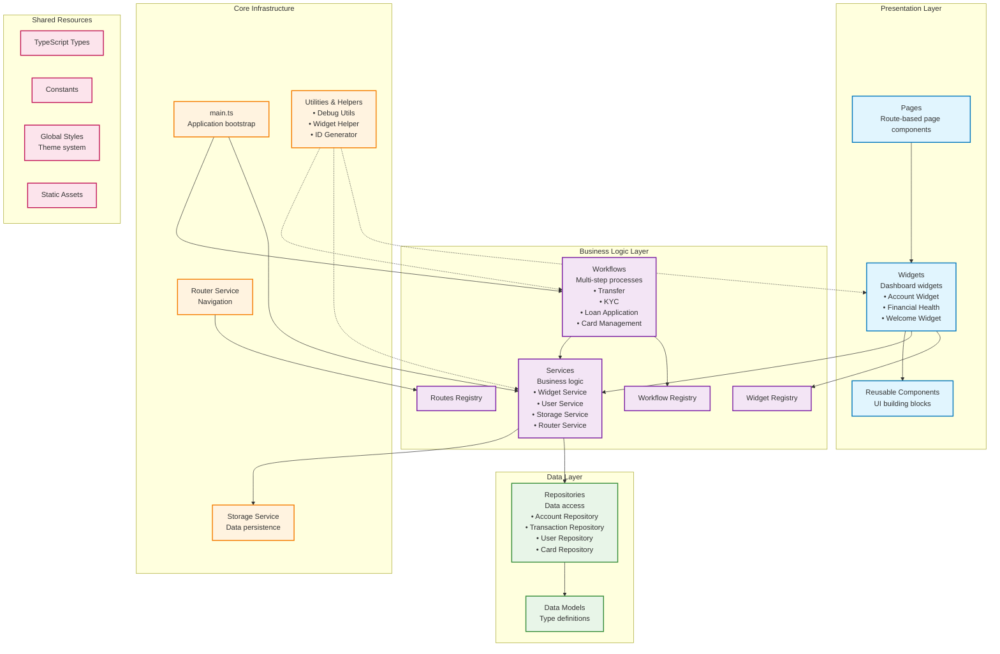

# Dream - Banking Application

Dream is a modern banking and financial management application built with TypeScript and Web Components. It provides a widget-based architecture for managing accounts, transactions, and financial workflows.

## Features

- **Widget-based Dashboard**: Modular widgets for different financial features (accounts, financial health, welcome, etc.)
- **Workflow System**: Guided workflows for transfers, loan applications, KYC processes, and more
- **Account Management**: Support for multiple account types (checking, savings, etc.)
- **Card Management**: Credit and debit card functionality with activation and management workflows
- **Financial Health Tracking**: Insights and recommendations for financial wellness
- **Dark/Light Theme**: Responsive theming with system preference detection
- **Search Functionality**: Global search across widgets, workflows, and features

## Technology Stack

- **Frontend**: TypeScript, Web Components, FAST Element
- **Build Tool**: esbuild
- **Testing**: Vitest
- **Charts**: Chart.js
- **Styling**: CSS Custom Properties with theme support
- **Module System**: ES Modules with import maps

## Architecture

The application is built with a layered modular architecture that promotes separation of concerns and maintainability:



### Architecture Layers

**Presentation Layer:**
- **Widgets**: Self-contained dashboard widgets with their own state and logic (`/app/src/widgets/`)
- **Pages**: Route-based page components that compose widgets and handle navigation (`/app/src/pages/`)
- **Components**: Reusable UI building blocks shared across widgets and pages (`/app/src/components/`)

**Business Logic Layer:**
- **Workflows**: Multi-step guided processes for complex user interactions (`/app/src/workflows/`)
- **Services**: Core business logic and application state management (`/app/src/services/`)
- **Registries**: Central registration systems for widgets, workflows, and routes

**Data Layer:**
- **Repositories**: Data access abstraction layer with mock and REST implementations (`/app/src/repositories/`)
- **Models**: TypeScript interfaces and data models (`/app/src/repositories/models/`)

**Core Infrastructure:**
- **Router Service**: SPA navigation and route management
- **Storage Service**: Local storage and data persistence
- **Utilities**: Helper functions, debug tools, and shared utilities (`/app/src/utilities/`, `/app/src/helpers/`)

**Shared Resources:**
- **Types**: Application-wide TypeScript type definitions (`/app/src/types/`)
- **Constants**: Shared configuration and constant values (`/app/src/constants/`)
- **Styles**: Global CSS and theme system (`/app/src/styles/`)
- **Assets**: Static resources like images and icons (`/app/src/assets/`)

## Getting Started

### Prerequisites

- Node.js (version 16 or higher)
- npm or yarn

### Installation

1. Clone the repository:
   ```bash
   git clone https://github.com/glideroggan/dream.git
   cd dream
   ```

2. Navigate to the app directory:
   ```bash
   cd app
   ```

3. Install dependencies:
   ```bash
   npm install
   ```

### Development

Start the development server:
```bash
npm run dev
```

This will start the development server with hot reload and serve the application locally.

For CLI-only development (using esbuild directly):
```bash
npm run dev:cli
```

### Testing

Run the test suite:
```bash
npm run test
```

Run tests in watch mode:
```bash
npm run test:watch
```

### Building

Build for production:
```bash
npm run docker:build
```

## Available Scripts

- `npm run dev` - Start development server with TypeScript compilation
- `npm run dev:cli` - Start esbuild development server with watch mode
- `npm run test` - Run test suite with Vitest
- `npm run test:watch` - Run tests in watch mode
- `npm run docker:build` - Build for production
- `npm run clean` - Clean build artifacts

## Project Structure

```
app/
├── src/
│   ├── components/     # Reusable UI components
│   ├── widgets/        # Dashboard widgets
│   ├── workflows/      # Multi-step user processes
│   ├── services/       # Business logic services
│   ├── repositories/   # Data access layer
│   ├── pages/          # Page components
│   ├── styles/         # Global styles
│   ├── types/          # TypeScript type definitions
│   └── main.ts         # Application entry point
├── tests/              # Test files
└── dist/               # Build output (generated)
```

## Widgets

Available widgets include:

- **Account Widget**: Account balances and quick actions
- **Financial Health Widget**: Financial insights and recommendations
- **Welcome Widget**: User onboarding and guidance
- **Swish Widget**: Payment functionality
- **Error Widget**: Error handling and display

## Workflows

Supported workflows:

- **Transfer**: Money transfers between accounts
- **Loan Application**: Loan request process
- **Card Management**: Card activation and management
- **KYC (Know Your Customer)**: Identity verification
- **Account Creation**: New account setup
- **Payment Contacts**: Contact management for payments

## Contributing

1. Fork the repository
2. Create a feature branch (`git checkout -b feature/amazing-feature`)
3. Commit your changes (`git commit -m 'Add some amazing feature'`)
4. Push to the branch (`git push origin feature/amazing-feature`)
5. Open a Pull Request

## Development Notes

For detailed development notes, bugs, and feature requests, see [DEVELOPMENT.md](DEVELOPMENT.md).

## License

This project is licensed under the MIT License - see the package.json file for details.

