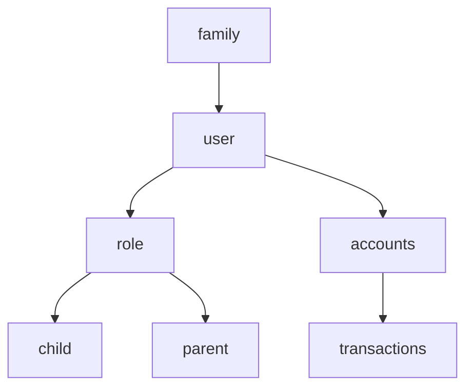

Ok, rework
Lets adjust everything for kidwallet

# needed
- create tickets
- create achievements
- swish payouts
- roles
  - child
  - parent
- share tasks with others
- notifications
- rewards from achievements
- authorization connected to login-service
  - webauthn
- landing page
  - login
  - register
- workflows
  - child
    - take loan
    - manage profile
    - get swish account
    - create accounts
      - saving account?
      - investment account?
  - parent
    - create achievements
    - create rewards
    - create tickets
    - approve tickets
    - manage family
- widgets
  - child
    - rewards from achievements
    - recommendations
    - statistics
    - achievements
    - account balances
  - parent
    - tickets to approve
    - ticket manager
    

