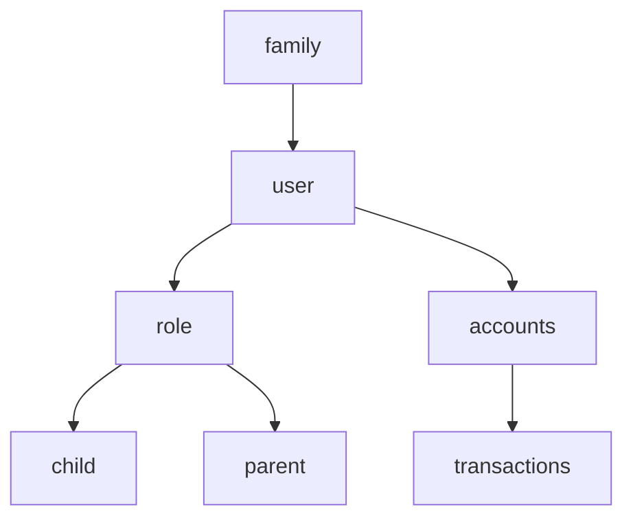

Ok, rework
Lets adjust everything for kidwallet

# TODO
- new widgets
  Start with just a grid element and a widget element
  - Make these from scratch, don't use the old ones
  steps
    - don't worry about anything else than having a an element that we can get out on the grid
      - one grid
      - one widget
    - move the widget around
      - pick up and move the widget somewhere else on the grid

- widget handling
  - make sure the cells size doesn't change
  - hardcode the size of the widget to start
- fix widget movement/handling
  - fix widget resizing
  - fix widget dragging

# needed
- create tickets
- create achievements
- swish payouts
- roles
  - child
  - parent
- share tasks with others
- notifications
- rewards from achievements
- authorization connected to login-service
  - webauthn
- landing page
  - login
  - register
- workflows
  - child
    - take loan
    - manage profile
    - get swish account
    - create accounts
      - saving account?
      - investment account?
  - parent
    - create achievements
    - create rewards
    - create tickets
    - approve tickets
    - manage family
- widgets
  - child
    - rewards from achievements
    - recommendations
    - statistics
    - achievements
    - account balances
  - parent
    - tickets to approve
    - ticket manager
    

